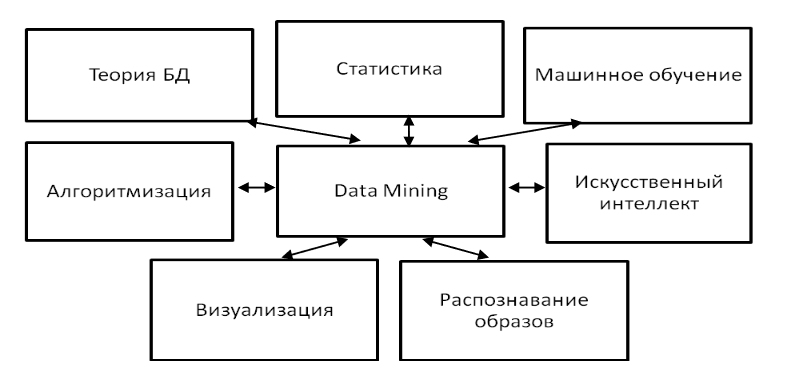
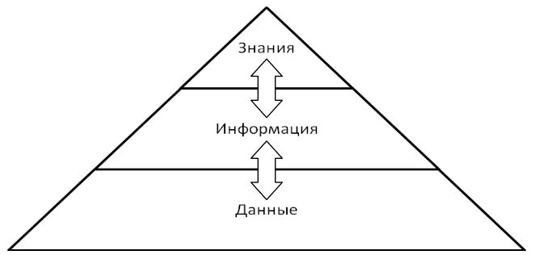
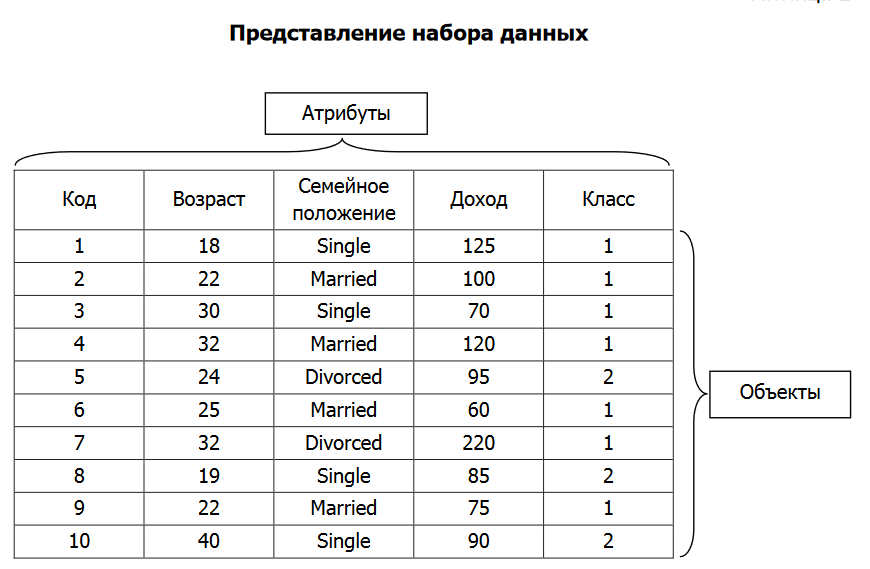
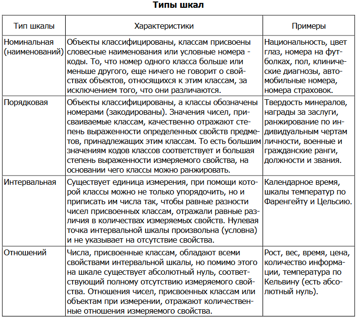
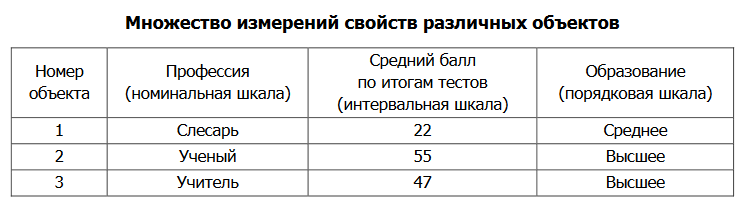

### [Список вопросов](main.md)

# Основные понятия интеллектуального анализа данных.

## Data Mining

Понятие интеллектуального анализа данных соответствует широко распространенному термину **Data Mining**, который часто переводится как добыча данных.

Понятие **Data Mining**, появившееся в **1978** году, приобрело большую популярность в современной трактовке примерно с первой половины **1990-х** годов. До этого времени обработка и анализ данных осуществлялся в рамках прикладной статистики, при этом в основном решались задачи по обработке небольших баз данных.

**Data Mining** - мультидисциплинарная область, возникшая и развивающаяся на базе таких наук, как прикладная статистика, распознавание образов, искусственный интеллект, теория баз данных и др.

**Data Mining** представляет собой процесс поддержки принятия решений, основанный на поиске в больших объемах данных неочевидных, объективных и полезных на практике закономерностей:
- **неочевидных**, так как найденные закономерности не обнаруживаются стандартными методами обработки информации или экспертным путем;
- **объективных**, так как обнаруженные закономерности будут полностью соответствовать действительности, в отличие от экспертного мнения, которое всегда является субъективным;
- **практически полезных**, так как выводы имеют конкретное значение, которому можно найти практическое применение.

## Business Intelligence

**Business Intelligence** в широком смысле слова определяет процесс превращения данных в информацию и знания о бизнесе для поддержки принятия улучшенных и неформальных решений.

Принятие решений требует информации, которая основана на данных. Эти понятия являются составной частью так называемой **информационной пирамиды**. Целью Business Intelligence является преобразование объемов данных в ценность бизнеса.

**Верхний уровень** приложений является уровнем бизнеса, на нем менеджеры принимают решения (перекрестные продажи, контроль качества, удерживание клиентов). **Средний уровень** действий является уровнем информации, именно на нем выполняются действия Data Mining (прогностическое моделирование, анализ связей, сегментация данных и другие). **Нижний уровень** определяет задачи Data Mining, которую необходимо решить применительно к данным, имеющимся в наличии.

## Отличия Data Mining от других методов анализа данных

Имеется ряд существенных отличий Data Mining от других методов анализа данных.

Традиционные методы анализа данных (статистические методы) и OLAP в основном ориентированы на **проверку заранее сформулированных гипотез** (verification-driven data mining) и на "грубый" разведочный анализ, составляющий основу оперативной аналитической обработки данных (OnLine Analytical Processing, OLAP), в то время как одно из основных положений Data Mining - **поиск неочевидных
закономерностей**.

Большинство статистических методов для выявления взаимосвязей в данных используют концепцию усреднения по выборке, приводящую к **операциям над несуществующими величинами**, тогда как Data Mining **оперирует реальными значениями**.

OLAP больше подходит для **понимания ретроспективных данных**, Data Mining опирается на ретроспективные данные для **получения ответов на вопросы о будущем**.

# Наборы данных, их типы и свойства.

В широком понимании данные представляют собой факты, текст, графики, картинки, звуки, аналоговые или цифровые видеосегменты. Данные могут быть получены в результате измерений, экспериментов, арифметических и логических операций. Данные должны быть представлены в форме, пригодной для хранения, передачи и обработки. Иными словами, данные – это необработанный материал, предоставляемый поставщиками данных и используемый
потребителями для формирования информации на основе данных.

Набор данных может быть представлен двухмерной таблицей. Атрибут – свойство, характеризующее объект: цвет глаз человека, температура воды и т.д. Атрибут также называют полем таблицы, измерением.

При анализе данных, как правило, нет возможности рассмотреть всю интересующую нас совокупность объектов. Изучение очень больших объемов данных является дорогостоящим процессом, требующим больших временных затрат, к тому же неизбежно приводящим к ошибкам,
связанным с человеческим фактором.

Вполне достаточно рассмотреть некоторую часть всей совокупности, то есть **выборку**, и получить интересующую нас информацию на ее основе. Однако размер выборки зависит от разнообразия объектов, представленных в генеральной совокупности. В выборке должны быть представлены различные комбинации и элементы генеральной совокупности.

Измерение – процесс присвоения чисел характеристикам изучаемых объектов согласно определенному правилу. В процессе подготовки данных измеряется не сам объект, а его характеристики. Шкала – правило, в соответствии с которым объектам присваиваются числа.

Переменные (значения атрибутов объектов) могут являться **числовыми** данными либо **символьными**. Числовые данные, в свою очередь, могут быть **дискретными** и **непрерывными**.

**Дискретные данные** являются значениями признака, общее число которых конечно либо бесконечно, но может быть подсчитано при помощи натуральных чисел от одного до бесконечности. Пример дискретных данных: продолжительность маршрута троллейбуса (количество вариантов продолжительности конечно): 10, 15, 25 минут.

**Непрерывные данные** – данные, значения которых могут принимать какое угодно значение в некотором интервале. Измерение непрерывных данных предполагает большую точность. Пример непрерывных данных: температура, высота, вес, длина и т.д.

Существует пять типов шкал измерений: **номинальная, порядковая, интервальная, относительная и дихотомическая**.

**Номинальная шкала (nominal scale)** – шкала, содержащая только **категории**; данные в ней не могут упорядочиваться, с ними не могут быть произведены никакие арифметические действия.

Номинальная шкала состоит из названий, категорий, имен для классификации и сортировки объектов или наблюдений по некоторому признаку. Примеры такой шкалы: профессии, город проживания, семейное положение. Для этой шкалы применимы только операции равно, не
равно.

**Порядковая шкала (ordinal scale)** – шкала, в которой числа присваивают объектам для обозначения относительной позиции объектов, но не величины различий между ними.

Шкала измерений дает возможность ранжировать значения переменных. Измерения же в порядковой шкале содержат информацию только о порядке следования величин, но не позволяют сказать, насколько одна величина больше другой или насколько она меньше другой. Примеры такой шкалы: место (1, 2, 3-е), которое команда получила на соревнованиях; номер студента в рейтинге успеваемости (1-й, 23-й и т.д.). При этом
неизвестно, насколько один студент успешней другого, известен лишь его номер в рейтинге. Для этой шкалы применимы операции: равно (=), не равно (≠), больше (>), меньше (<).

**Интервальная шкала (interval scale)** – шкала, разности между значениями которой могут быть вычислены, однако их отношения не имеют смысла. Эта шкала позволяет находить разницу между двумя величинами, обладает свойствами номинальной и порядковой шкал, а также позволяет определить количественное изменение признака. Примеры такой шкалы: температура воды в море утром 19 градусов, вечером – 24, т.е. вечерняя на 5 градусов выше, но нельзя сказать, что она в 1,26 раз выше.

Номинальная и порядковая шкалы являются **дискретными**, а интервальная шкала – **непрерывной**. Интервальная шкала позволяет осуществлять точные измерения признака и производить арифметические операции сложения, вычитания. Для этой шкалы применимы операции: равно (=), не равно (≠), больше (>), меньше (<), операции сложения (+) и вычитания (-).

**Относительная шкала (ratio scale)** – шкала, в которой есть определенная точка отсчета и возможны отношения между значениями шкалы. Примеры такой шкалы: вес новорожденных детей 4 кг и 3 кг (первый в 1,33 раза тяжелее); цена на картофель в супермаркете выше в 1,2 раза, чем цена на базаре.

Относительные и интервальные шкалы являются числовыми.

**Дихотомическая шкала (dichotomous scale)** – шкала, содержащая только две категории. Пример такой шкалы: пол (мужской и женский).

**Пример использования** разных шкал для измерений свойств различных объектов.

Наиболее часто встречаются данные, состоящие из **записей**.

Примеры таких наборов данных: **табличные данные** (состоят из записей, каждая из которых состоит из фиксированного набора атрибутов), **матричные данные**, **документальные данные**, **транзакционные** (каждая запись, являющаяся транзакцией, включает набор значений) или **операционные**.

Большинство инструментов Data Mining позволяет импортировать данные из различных источников, а также экспортировать результирующие данные в различные форматы.

Большинство BI-инструментов, представленных на рынке, использует слой метаданных.

**Метаданные (Metadata)** – это данные о данных. Метаданные содержат сведения о составе данных, содержании, статусе, происхождении, местонахождении, качестве, форматах и формах представления, условиях доступа, приобретения и использования, авторских, имущественных и смежных с ними правах на данные и др.

Метаданные, применяемые при управлении хранилищем, содержат информацию, необходимую для его настройки и использования. Различают бизнес-метаданные и оперативные метаданные.

**Бизнес-метаданные** включают определения данных, которые хранятся в источниках данных, в терминах предметной области. Они также могут содержать правила и вычисления, которые должны быть определены для этого бизнеса. Кроме того, существуют технические метаданные для доступа к физическим данным. CASE-средства *(computer-aided software engineering — набор инструментов и методов программной инженерии для проектирования программного обеспечения, которые помогают обеспечить высокое качество программ, отсутствие ошибок и простоту в обслуживании программных продуктов)*, реляционные СУБД, средства извлечения, преобразования и загрузки данных используют метаданные. Бизнес-метаданные содержат бизнес-термины и определения, принадлежность данных и правила оплаты услуг хранилища.

**Оперативные метаданные** – это информация, собранная во время работы хранилища данных:
- происхождение перенесенных и преобразованных данных;
- статус использования данных (активные, архивированные или удаленные);
- данные мониторинга (статистика использования, сообщения об ошибках и т.д.).