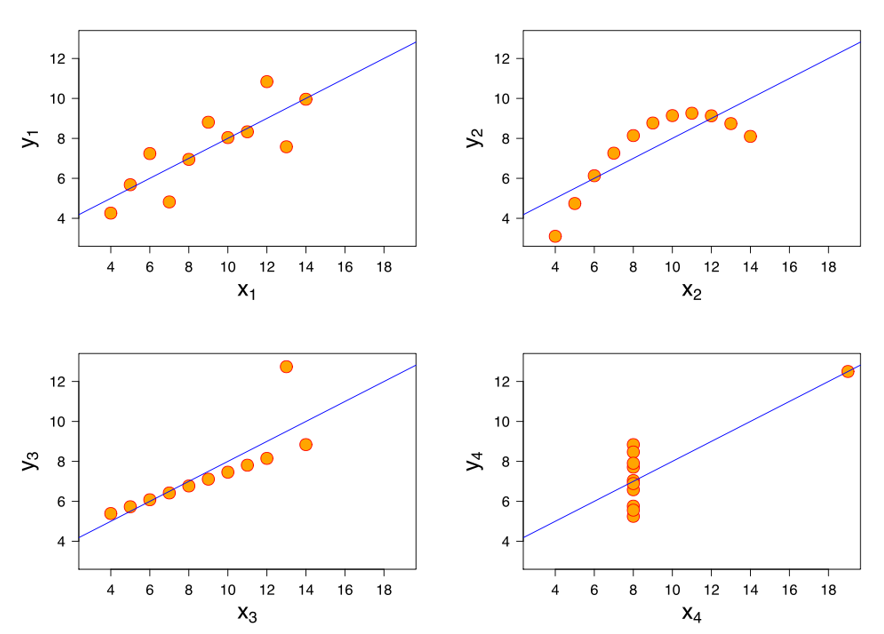

### [Список вопросов](main.md)

# Визуализация данных. Основные виды графиков и диаграмм.

## Визуализация данных

Сводная **статистика** дает нам некоторое представление о данных:
- Среднее значение против медианы
- Стандартное отклонение
- Квартиль, минимум/максимум
- Корреляцию между переменными

**Визуализация** позволяет получить более целостное представление.

**Квартет Энскомба** – это синтезированный пример статистика Ф. Дж. Энскомба. Значения этих четырех наборов данных различны, но свойства (среднее, дисперсия, корреляция, регрессия) одинаковы.

Что можно сделать?
- **Рассмотреть распределение одной переменной.** Мы узнаем значение диапазона данных, возможно нужно рассмотреть логарифмическую шкалу. Увидим выбросы или аномалии. Увидим форму и тип распределения. Использовать **plot**(если данных немного), **plot (kind='bar')** (столбачатая), **plot (kind='density')**(график плотности).
- **Анализ отношений между двумя переменными.** Можно построить диграмму рассеивания **scatter**(с точками, но не точечная), накинуть туда сглаживающую прямую LOESS или линию линейной регрессии. Если данных много, то лучше использовать **hexbin**, тогда яркость каждого гексагона будет показывать плотность данных в этой области. Есть еще столбчатые диаграммы (**barcharts**), точечная (**dotplots**), "ящик с усами" (**box** и **whisker**). Можем узнать, есть ли взаимосвязь между двумя переменными (линейная, квадратичная, экспоненциальная (построить полу-log или log-log графики), облако точек).
- **Множественное попарное отношение между переменными.** Чтобы быстро изучить попарные взаимосвязи между всеми переменными можно использовать **seaborn.Jointplot**
- **Анализ одной переменной в течение долгого времени.** Визуализируем также как и в случае двух переменных, но от времени и на большой период. Ищем тенденции, сезонность, можно увидеть скорость роста.
