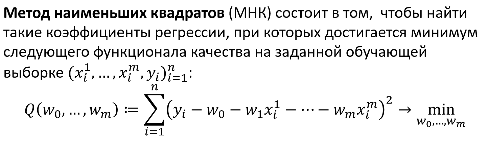
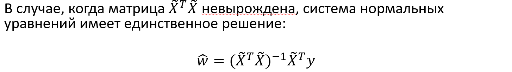
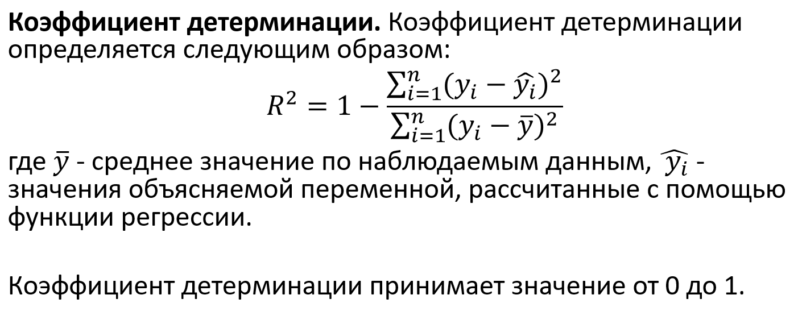
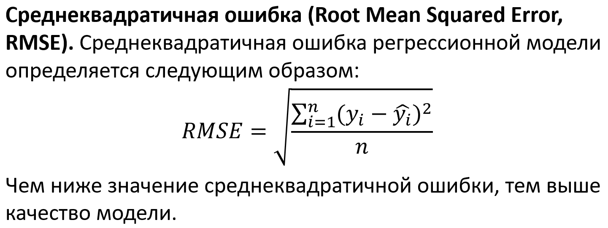

### [Список вопросов](main.md)

# Регрессия. Функции ошибок. Линейная регрессия.

Задача регрессии - это одна из основных задач машинного обучения. Относится к категории задач обучения с учителем. Например, предсказание цены объекта недвижимости - классическая регрессионная задача.

**Регрессионная модель** - это функция, которая принимает на вход значения атрибутов какого-то конкретного объекта и выдает на выходе предполагаемое значение целевой переменной.

Регрессионные модели подразделяют на парную и множественную регрессии. Парная регрессия - это когда у нас всего один атрибут. Множественная - когда больше одного.

**Функции ошибок:** MAE, MSE, Hoober.
