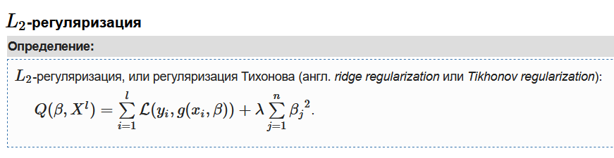
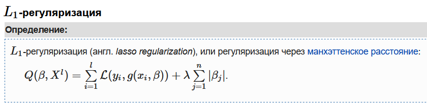
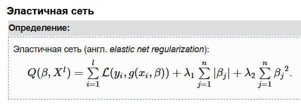

### [Список вопросов](main.md)

# Регуляризация в задаче регрессии. Нелинейная регрессия.

Регуляризация (англ. regularization) в статистике, машинном обучении, теории обратных задач — метод добавления некоторых дополнительных ограничений к условию с целью решить некорректно поставленную задачу или предотвратить переобучение. Чаще всего эта информация имеет вид штрафа за сложность модели.

Минимизация регуляризованного cоответствующим образом эмпирического риска приводит к выбору такого вектора параметров β, которое не слишком сильно отклоняется от нуля. В линейных классификаторах это позволяет избежать проблем мультиколлинеарности и переобучения. 

Данный вид регуляризации также позволяет ограничить значения вектора β. Однако, к тому же он обладает интересным и полезным на практике свойством — обнуляет значения некоторых параметров, что в случае с линейными моделями приводит к отбору признаков. 

Приведенная регуляризация использует как L1, так и L2 регуляризации, учитывая эффективность обоих методов. Ее полезной особенностью является то, что она создает условия для группового эффекта при высокой корреляции переменных, а не обнуляет некоторые из них, как в случае с L1-регуляризацией. 
